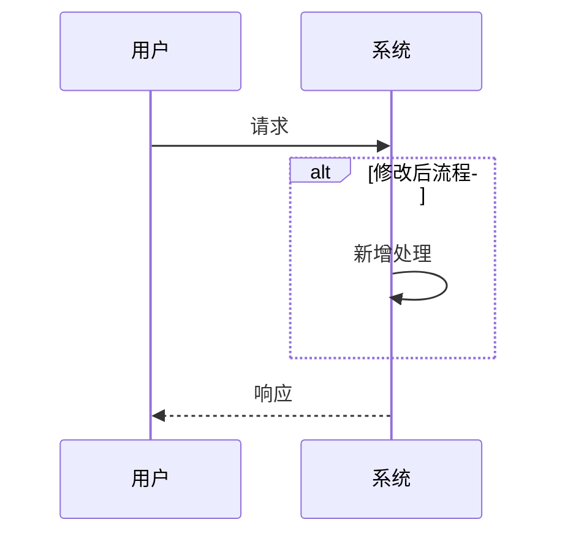

# 修改需求技术方案

## 基本信息

- **需求名称**：
- **需求文档**：`docs/requirements-planning/<主题>.md`
- **技术方案版本**：
- **创建日期**：
- **作者**：

---

## 1. 概述

### 1.1 背景
[描述修改的业务背景和原因]

### 1.2 修改内容
[简述本次修改的核心内容]

### 1.3 影响范围
- **影响模块**：[模块名]
- **影响页面**：[页面名]
- **影响接口**：[接口名]
- **影响数据库**：[表名]

---

## 2. 现状分析

### 2.1 当前实现
[描述当前系统的实现方式]

### 2.2 问题描述

| 序号 | 问题 | 严重程度 | 影响范围 |
|------|------|---------|---------|
| 1 | | 高/中/低 | |
| 2 | | 高/中/低 | |

---

## 3. 修改方案

### 3.1 修改点列表

| 序号 | 位置 | 修改类型 | 修改前 | 修改后 | 优先级 |
|------|------|---------|-------|-------|--------|
| 1 | | 新增/修改/删除 | | | P0 |
| 2 | | 新增/修改/删除 | | | P1 |

### 3.2 详细修改说明

#### 修改点1：[位置：模块/类/方法]

**当前实现**：
```java
// 当前代码
public void method() {
    // 现有逻辑
}
```

**修改后**：
```java
// 修改后代码
public void method() {
    // 新增逻辑
    // 修改逻辑
}
```

**修改原因**：
[说明为什么需要这样修改]

**影响范围**：
- 影响的接口：
- 影响的模块：
- 回归测试点：

---

## 4. 接口变化

### 4.1 新增接口

| 接口名称 | 方法 | 路径 | 说明 |
|---------|------|------|------|
| | | | |

### 4.2 修改接口

#### 接口：[接口名称]

**修改内容**：

| 类别 | 修改项 | 修改前 | 修改后 |
|------|--------|-------|-------|
| 请求参数 | | | |
| 响应数据 | | | |
| 业务逻辑 | | | |

**兼容性**：
- [ ] 向前兼容
- [ ] 需版本升级
- [ ] 废弃旧版本

### 4.3 废弃接口

| 接口名称 | 废弃版本 | 替代方案 |
|---------|---------|---------|
| | | |

---

## 5. 数据库变化

### 5.1 表结构变更

| 表名 | 变更类型 | 说明 |
|------|---------|------|
| | 新增字段/修改字段/删除字段 | |

#### 字段变更详情

**表：xxx**

| 字段名 | 变更类型 | 原定义 | 新定义 | 说明 |
|--------|---------|-------|-------|------|
| field1 | 修改 | VARCHAR(50) | VARCHAR(100) | 长度增加 |
| field2 | 新增 | - | VARCHAR(200) | 新增字段 |
| field3 | 删除 | INT | - | 删除字段 |

### 5.2 索引变更

| 表名 | 索引名 | 变更类型 | 说明 |
|------|--------|---------|------|
| | | 新增/删除 | |

### 5.3 数据迁移

#### 迁移方案

```sql
-- 数据迁移脚本
-- 1. 迁移历史数据
UPDATE xxx SET new_field = old_field WHERE new_field IS NULL;

-- 2. 清理旧数据
-- 注意：执行前请先备份
-- DELETE FROM xxx WHERE ...
```

#### 迁移顺序
1. [ ] 备份数据
2. [ ] 执行DDL
3. [ ] 执行数据迁移
4. [ ] 验证数据

---

## 6. 业务流程变化

### 6.1 流程对比

| 流程 | 修改前 | 修改后 | 变化说明 |
|------|-------|-------|---------|
| 业务流程A | 步骤1→步骤2→步骤3 | 步骤1→新步骤→步骤2→步骤3 | 新增校验步骤 |

### 6.2 时序图



---

## 7. 异常处理变化

### 7.1 新增异常

| 异常类 | 错误码 | HTTP状态码 | 说明 |
|--------|--------|-----------|------|
| | | | |

### 7.2 变化异常

| 异常类 | 修改内容 |
|--------|---------|
| | |

---

## 8. 安全变化

### 8.1 权限变化
[描述新增或修改的权限控制]

### 8.2 数据安全
[描述敏感数据处理的变化]

---

## 9. 性能影响

### 9.1 性能评估

| 指标 | 修改前 | 修改后 | 变化 |
|------|-------|-------|------|
| 响应时间 | 100ms | 120ms | +20ms |
| CPU使用率 | 30% | 35% | +5% |

### 9.2 优化措施
[如有性能影响，描述优化措施]

---

## 10. 回滚方案

### 10.1 回滚触发条件
- [ ] 功能严重bug影响核心流程
- [ ] 性能问题导致系统不可用
- [ ] 数据异常

### 10.2 回滚步骤

| 步骤 | 操作 | 说明 |
|------|------|------|
| 1 | 回滚数据库 | 执行反向DDL |
| 2 | 回滚代码 | 部署上一版本 |
| 3 | 验证 | 确认功能正常 |

### 10.3 回滚时间
预计回滚时间：[X]分钟

---

## 11. 测试方案

### 11.1 回归测试
- [ ] 受影响接口测试
- [ ] 受影响功能测试
- [ ] 关联功能测试

### 11.2 专项测试

| 测试类型 | 测试场景 | 预期结果 |
|---------|---------|---------|
| 边界条件 | | |
| 异常场景 | | |
| 性能测试 | | |

### 11.3 兼容性测试
- [ ] 历史数据兼容性测试
- [ ] 旧版本API兼容性测试

---

## 12. 发布计划

### 12.1 发布顺序

| 步骤 | 操作 | 说明 |
|------|------|------|
| 1 | 数据库变更 | DDL + 数据迁移 |
| 2 | 代码部署 | 灰度/全量 |
| 3 | 验证 | 功能验证 |
| 4 | 监控 | 观察异常 |

### 12.2 发布窗口
- 建议发布时间：
- 预计停机时间：

---

## 13. 风险与应对

| 风险 | 等级 | 应对措施 |
|------|------|---------|
| 回滚失败 | 高 | 提前准备回滚脚本 |
| 数据不一致 | 中 | 事务保证 + 数据校验 |
| 性能下降 | 低 | 提前压测 |

---

## 14. 里程碑

| 里程碑 | 计划日期 | 交付物 |
|--------|----------|--------|
| 技术方案评审 | | 技术方案文档 |
| 开发完成 | | 代码 |
| 测试完成 | | 测试报告 |
| 上线 | | 部署 |
| 观察期 | | 监控报告 |

---

## 附录

### 相关文档
- 需求文档：`docs/requirements-planning/<主题>.md`
- 子任务清单：`task.md`

### 回滚脚本
```sql
-- 回滚SQL脚本
-- 执行顺序与发布相反
```
