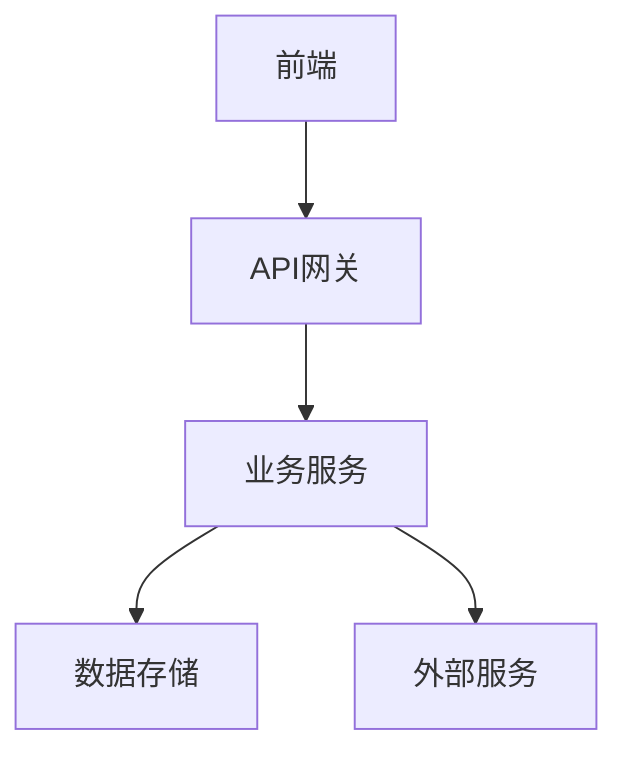
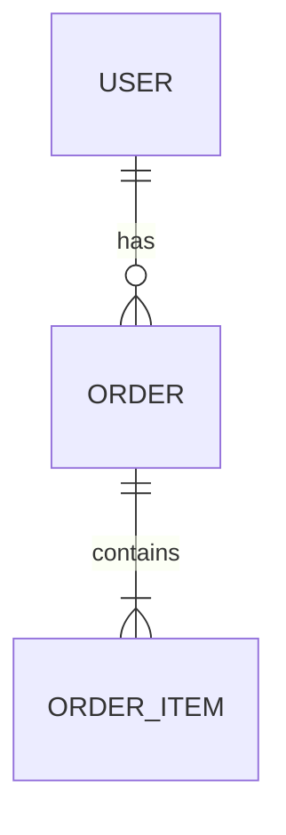
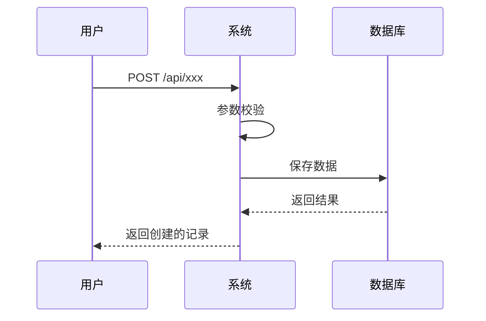
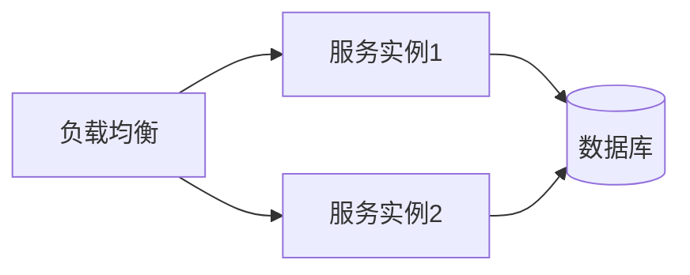

# 新增需求技术方案

## 基本信息

- **需求名称**：
- **需求文档**：`docs/requirements-planning/<主题>.md`
- **技术方案版本**：
- **创建日期**：
- **作者**：

---

## 1. 概述

### 1.1 背景
[描述新功能产生的业务背景]

### 1.2 目标
[描述技术方案要实现的功能目标]

### 1.3 范围
- **在范围内**：本方案覆盖的功能范围
- **不在范围内**：明确不在本方案中的功能

---

## 2. 架构设计

### 2.1 整体架构



### 2.2 新增模块

| 模块名 | 职责 | 位置 |
|--------|------|------|
| | | |

### 2.3 技术选型

| 组件 | 选型 | 理由 |
|------|------|------|
| 开发语言 | | |
| 框架 | | |
| 数据库 | | |
| 缓存 | | |
| 消息队列 | | |
| 其他 | | |

---

## 3. 模块设计

### 3.1 模块结构

```
src/
├── module-a/
│   ├── controller/
│   ├── service/
│   ├── repository/
│   ├── model/
│   └── dto/
└── ...
```

### 3.2 核心类设计

#### Controller层

```java
@RestController
@RequestMapping("/api/xxx")
@RequiredArgsConstructor
public class XxxController {

    private final XxxService xxxService;

    // 接口定义
}
```

#### Service层

```java
@Service
@RequiredArgsConstructor
public class XxxService {

    private final XxxRepository xxxRepository;

    // 业务逻辑
}
```

#### Repository层

```java
public interface XxxRepository extends JpaRepository<Xxx, Long> {

    // 查询方法
}
```

---

## 4. 数据库设计

### 4.1 新增表

#### 表：xxx

| 字段名 | 类型 | 必填 | 说明 | 备注 |
|--------|------|------|------|------|
| id | BIGINT | 是 | 主键 | 自增 |
| name | VARCHAR(100) | 是 | 名称 | |
| status | TINYINT | 是 | 状态 | 0-禁用 1-启用 |
| created_at | DATETIME | 是 | 创建时间 | |
| updated_at | DATETIME | 是 | 更新时间 | |

### 4.2 索引

| 表名 | 索引名 | 字段 | 类型 |
|------|--------|------|------|
| xxx | idx_name | name | UNIQUE |
| xxx | idx_status | status | INDEX |

### 4.3 ER图



---

## 5. 接口设计

### 5.1 接口列表

| 接口名称 | 方法 | 路径 | 说明 |
|---------|------|------|------|
| 创建xxx | POST | /api/xxx | 创建 |
| 查询xxx | GET | /api/xxx/{id} | 详情 |
| 更新xxx | PUT | /api/xxx/{id} | 更新 |
| 删除xxx | DELETE | /api/xxx/{id} | 删除 |
| 列表xxx | GET | /api/xxx | 列表 |

### 5.2 接口详情

#### 创建xxx

**请求**：
```json
{
  "name": "名称 | 必填",
  "description": "描述 | 可选"
}
```

**响应**：
```json
{
  "code": "200",
  "data": {
    "id": 1,
    "name": "名称",
    "status": 1
  },
  "message": "success"
}
```

---

## 6. 业务流程

### 6.1 核心流程



### 6.2 异常处理

| 场景 | HTTP状态码 | 错误码 | 错误信息 |
|------|-----------|--------|---------|
| 参数校验失败 | 400 | INVALID_PARAM | 参数错误 |
| 数据不存在 | 404 | NOT_FOUND | 数据不存在 |
| 重复数据 | 409 | DUPLICATE | 数据已存在 |

---

## 7. 安全设计

### 7.1 认证授权
[描述接口认证方式：JWT/Session/OAuth2]

### 7.2 权限控制
[描述需要哪些权限]

### 7.3 数据安全
[描述敏感数据处理方式]

---

## 8. 性能设计

### 8.1 性能指标

| 指标 | 目标值 |
|------|-------|
| 接口响应时间 | <200ms |
| 支持并发数 | 1000 |
| 数据库连接数 | <50 |

### 8.2 优化策略

- [ ] 索引优化
- [ ] 缓存策略
- [ ] 异步处理
- [ ] 分页加载

---

## 9. 兼容性设计

### 9.1 向后兼容
[描述如何保证向后兼容]

### 9.2 版本控制
[描述API版本策略]

---

## 10. 部署方案

### 10.1 部署架构



### 10.2 配置项

| 配置项 | 开发环境 | 测试环境 | 生产环境 |
|--------|---------|---------|---------|
| 数据库连接 | | | |
| 缓存配置 | | | |
| 日志级别 | | | |

---

## 11. 测试方案

### 11.1 单元测试
- 覆盖率目标：≥80%
- 测试框架：JUnit 5 + Mockito

### 11.2 集成测试
[描述集成测试场景]

### 11.3 接口测试
[描述接口测试用例]

---

## 12. 数据迁移

### 12.1 初始化数据
[描述需要初始化的基础数据]

### 12.2 迁移脚本
[描述数据迁移脚本（如有）]

---

## 13. 风险与应对

| 风险 | 等级 | 应对措施 |
|------|------|---------|
| 新模块影响现有系统 | 中 | 充分隔离，灰度发布 |
| 性能瓶颈 | 低 | 上线前压测 |

---

## 14. 里程碑

| 里程碑 | 计划日期 | 交付物 |
|--------|----------|--------|
| 技术方案评审 | | 技术方案文档 |
| 开发完成 | | 代码 |
| 测试完成 | | 测试报告 |
| 上线 | | 部署 |

---

## 附录

### 相关文档
- 需求文档：`docs/requirements-planning/<主题>.md`
- 子任务清单：`task.md`

### 参考资料
- [文档链接]
