# 项目分析模板

> 使用说明：复制此文件，命名为 `[项目名]-analysis.md`，并填写相关内容。

---

## 项目基本信息

| 项目 | 内容 |
|--------|---------|
| **名称** | |
| **项目路径** | |
| **项目类型** | 本地项目 / 远程仓库 |
| **主要语言** | |
| **总文件数** | |
| **代码行数** | |
| **描述** | |
| **许可证** | |
| **分析日期** | {{date}} |

---

## 项目结构

```
├── [目录结构]
└── ...
```

**关键目录说明：**

### 模块关系图

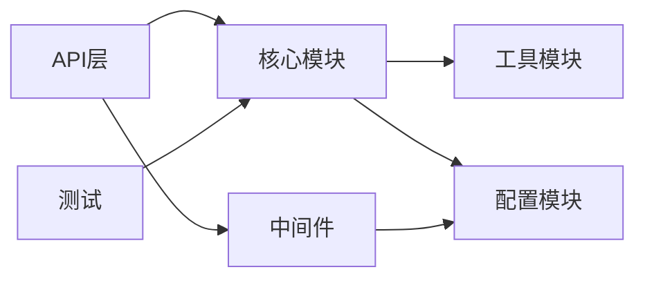

---

## 技术栈

- **主要语言：**
- **框架/库：**
- **构建工具：**
- **测试框架：**
- **CI/CD：**
- **其他依赖：**

### 依赖关系图

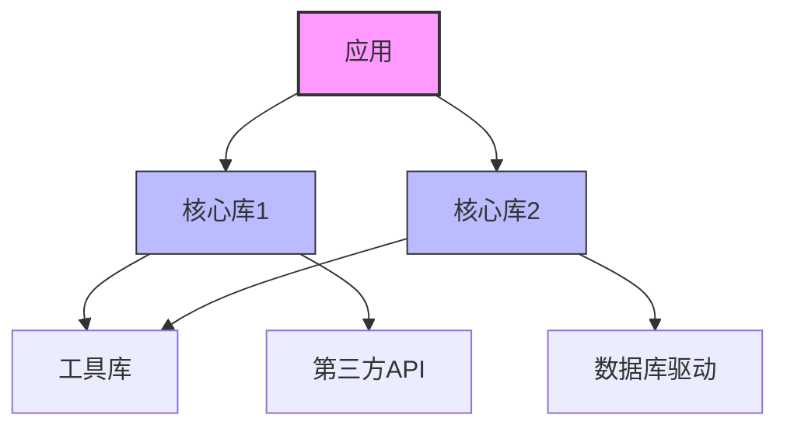

---

## 核心功能

1. [功能1]
2. [功能2]
3. [功能3]
4. ...

### 核心流程时序图

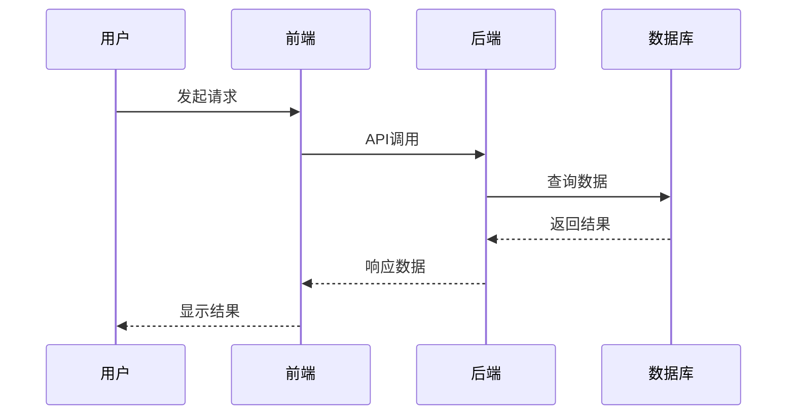

---

## 架构设计

### 架构模式
- [ ] MVC
- [ ] 微服务
- [ ] 分层架构
- [ ] 事件驱动
- [ ] 其他: ___

### 架构图

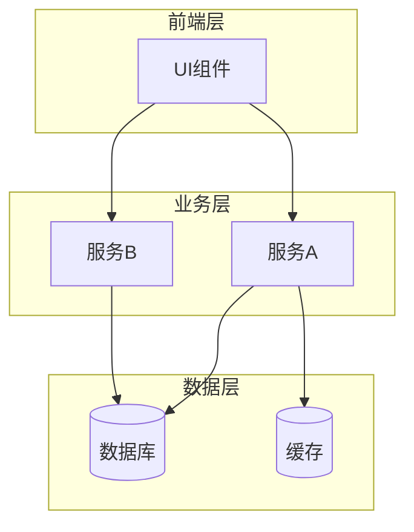

### 关键模块
| 模块 | 职责 | 依赖 |
|--------|---------------|--------------|
| | | |

### 数据流

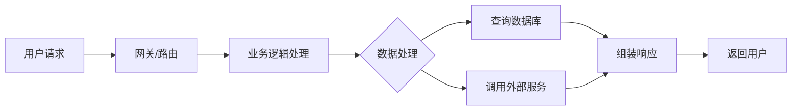

---

## 代码质量

### 代码风格
- Lint配置：
- 代码风格一致性：
- 命名规范：

### 测试覆盖
- 单元测试：
- 集成测试：
- E2E测试：
- 测试覆盖率（如有）：

### 代码复杂度
- 代码简洁度：
- 过长的函数/类：
- 代码坏味道（如重复代码、魔法数字等）：

---

## 文档质量

| 类型 | 评分 (1-5) | 描述 |
|------|-------------|-------------|
| README | ⭐⭐⭐⭐⭐ | |
| API文档 | ⭐⭐⭐⭐⭐ | |
| 贡献指南 | ⭐⭐⭐⭐⭐ | |
| 架构文档 | ⭐⭐⭐⭐⭐ | |
| 示例代码 | ⭐⭐⭐⭐⭐ | |

**文档亮点：**
- [ ] 清晰的安装步骤
- [ ] 快速入门示例
- [ ] 架构图/流程图
- [ ] FAQ部分
- [ ] 变更日志 (CHANGELOG)

---

## 项目活跃度

### Git历史（如有）
- 上月提交数：___
- 上3月提交数：___
- 主要贡献者数量：___
- 首次提交日期：___

### 本地开发活跃度
- 代码更新频率：___
- 测试活跃度：___
- 文档更新：___

### 项目成熟度
- 项目年龄：___
- 主要版本：___
- 开发阶段：___

---

## 优点

1. [优点1]
2. [优点2]
3. [优点3]

---

## 缺点/待改进

1. [缺点1]
2. [缺点2]
3. [缺点3]

---

## 使用场景

- 适用于：
  - ___
  - ___
- 不适用于：
  - ___
  - ___

---

## 学习价值

**值得学习：**
- [ ] 架构设计方法
- [ ] 代码组织方式
- [ ] 具体实现
- [ ] 测试策略
- [ ] 文档编写

**推荐阅读顺序：**
1. ___
2. ___
3. ___

---

## 参考资源

- 官方文档：___
- 教程/文章：___
- 视频教程：___
- 社区讨论：___

---

## 总结

---

## 深度分析（可选 - 技术深入分析）

> 注意：以下章节适用于需要源代码级分析的技术项目

---

## 源代码深入分析

### 核心代码路径

| 模块/函数 | 源码位置 | 关键文件/函数 | 描述 |
|----------------|----------------|-------------------|-------------|
| | | | |

### 核心数据结构

```go
// 示例：核心数据结构定义
type CoreStruct struct {
    Field1 Type
    Field2 Type
}
```

### 关键函数调用链

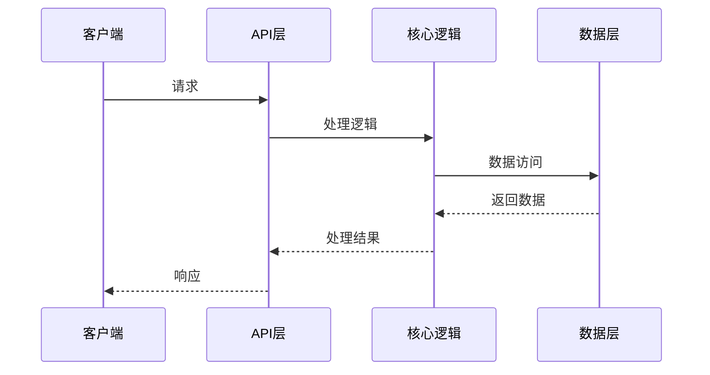

---

## 实现机制分析

### 核心机制分析

#### 机制1：[机制名称]

**工作原理：**
- [原理点1]
- [原理点2]
- [原理点3]

**实现流程：**

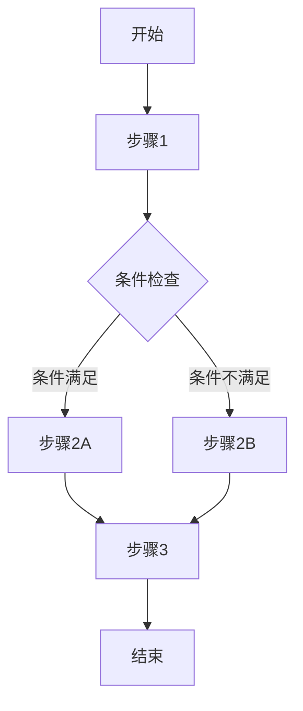

**关键代码片段：**

```
// 关键实现代码
function keyImplementation() {
    // 核心逻辑
}
```

#### 机制2：[机制名称]

[重复上述结构]

---

## 关键组件分析

### 组件架构图

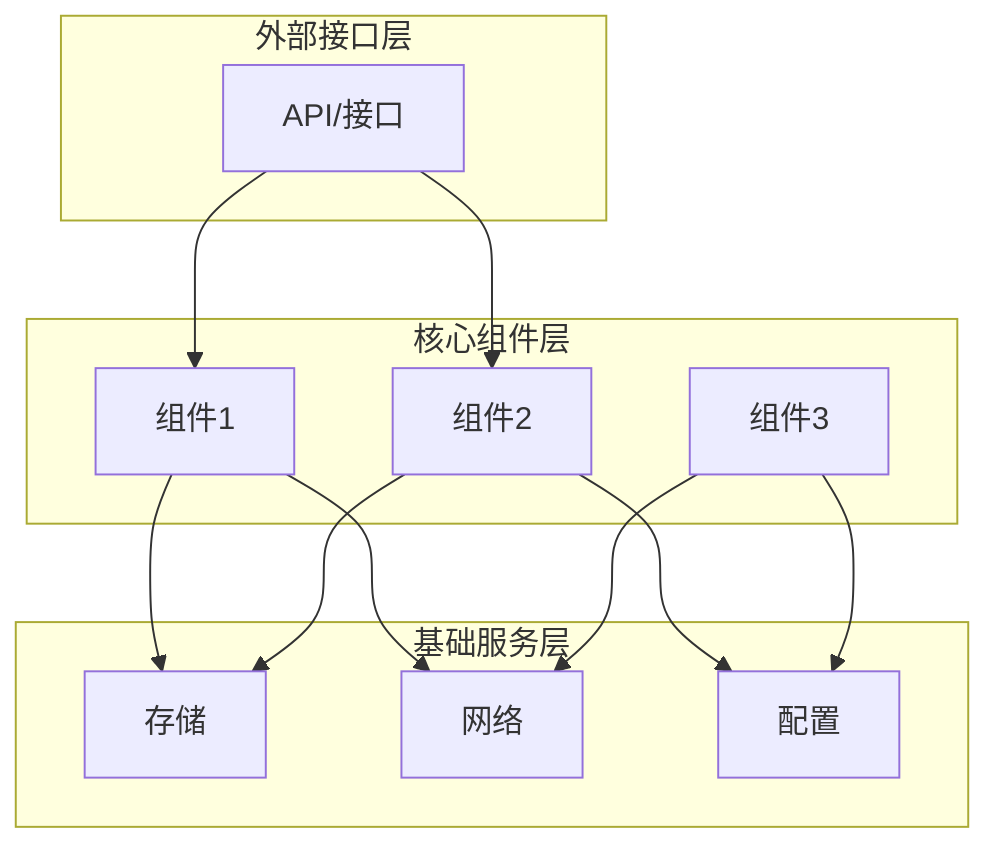

### 详细组件分析

#### 组件1：[组件名称]

**职责：**
- [职责1]
- [职责2]

**依赖：**
- 依赖：组件/模块
- 被依赖：组件/模块

**关键实现：**
- 文件位置：`path/to/file`
- 核心函数：`functionName()`

---

## 协议与接口分析

### API接口规范

| 接口 | 方法 | 路径 | 描述 |
|----------|--------|------|-------------|
| | | | |

### 通信协议

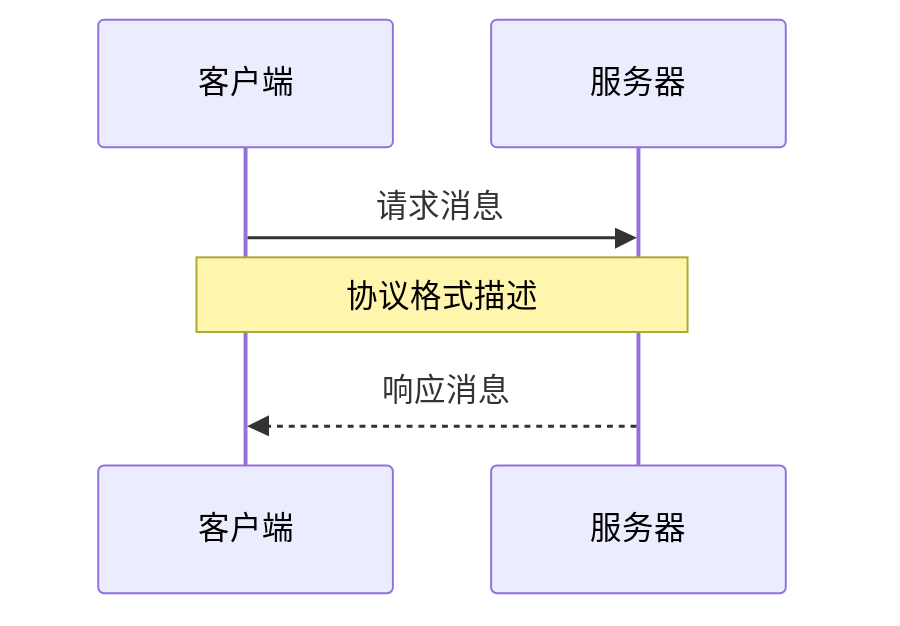

### 数据格式

```json
// 示例：JSON数据格式
{
  "field1": "value1",
  "field2": "value2"
}
```

---

## 工作流追踪

### 端到端流程分析

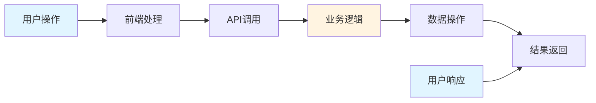

### 关键路径追踪

1. **入口点**：`[file:line]` - 函数 `main()` 或 `handler()`
2. **处理流程**：
   - 步骤1：`[file:line]` - 函数 `step1()`
   - 步骤2：`[file:line]` - 函数 `step2()`
   - 步骤3：`[file:line]` - 函数 `step3()`
3. **出口点**：`[file:line]` - 返回结果

---

## 安全分析

### 安全机制

| 机制类型 | 实现 | 保护范围 | 评估 |
|---------------|----------------|------------------|------------|
| 认证 | | | |
| 授权 | | | |
| 数据加密 | | | |
| 输入验证 | | | |

### 潜在安全风险

- [ ] 风险1：[描述]
- [ ] 风险2：[描述]
- [ ] 风险3：[描述]

### 安全最佳实践

- [ ] [实践1]
- [ ] [实践2]
- [ ] [实践3]

---

## 性能分析

### 性能特性

| 指标 | 性能 | 瓶颈 | 优化潜力 |
|--------|-------------|------------|----------------------|
| 响应时间 | | | |
| 吞吐量 | | | |
| 资源消耗 | | | |
| 并发能力 | | | |

### 性能优化机制

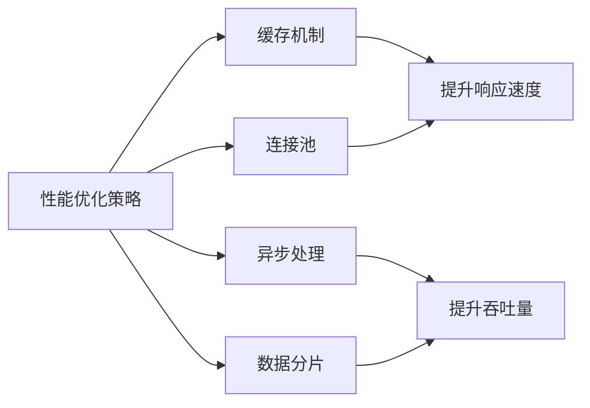

### 性能瓶颈

1. **瓶颈1**：[描述] - 位置：`[file:line]`
2. **瓶颈2**：[描述] - 位置：`[file:line]`
3. **优化建议**：[建议]

---

## 测试策略分析

### 测试覆盖

| 测试类型 | 覆盖范围 | 工具/框架 | 评估 |
|----------|----------------|------------------|------------|
| 单元测试 | | | |
| 集成测试 | | | |
| 端到端测试 | | | |
| 性能测试 | | | |
| 安全测试 | | | |

### 测试架构

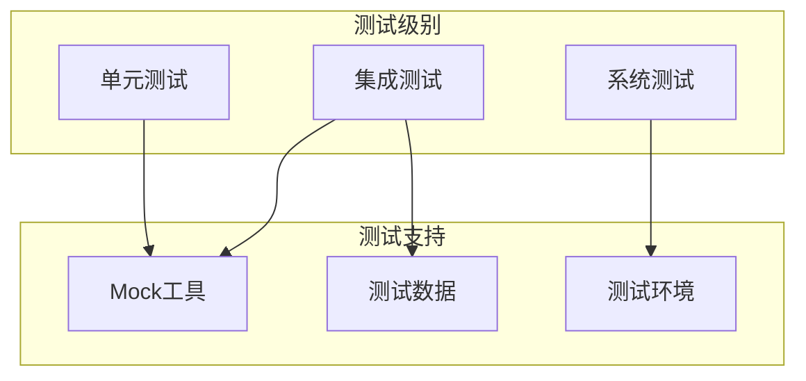

### 关键测试场景

- **场景1**：[描述]
  - 测试用例：`path/to/test_file`
  - 覆盖函数：`functionName()`

- **场景2**：[描述]
  - 测试用例：`path/to/test_file`
  - 覆盖函数：`functionName()`

---

## 实用配置示例

### 配置文件示例

```yaml
# 示例配置
key1: value1
key2: value2
section:
  item1: value3
```

### 部署架构

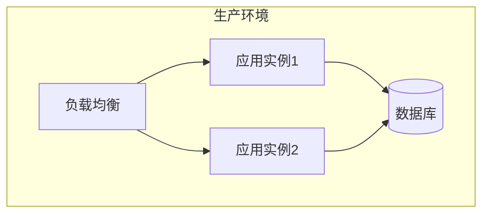

---

## 故障排查指南

### 常见问题

| 问题 | 症状 | 原因 | 解决方案 |
|-------|----------|-------|----------|
| | | | |

### 调试命令

```bash
# 示例调试命令
command1 --option
command2 --debug
```

### 日志分析

- 日志位置：`path/to/logs`
- 关键日志格式：[示例格式]
- 日志级别配置：[配置描述]

---

## 总结更新

### 可选补充图表

#### 状态转换图（如适用）

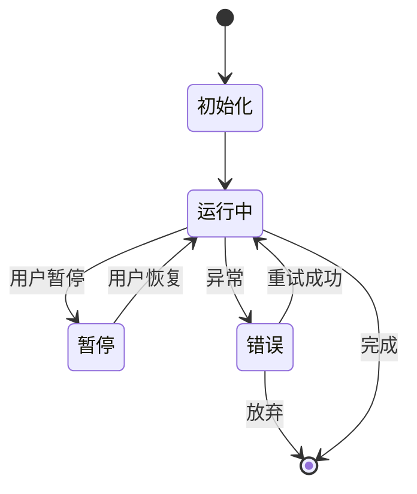

#### 数据库ER图（如适用）

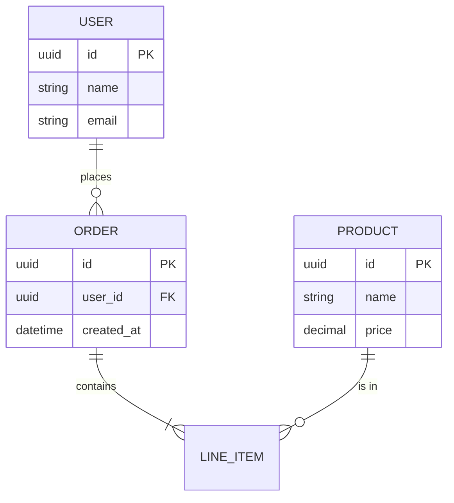

#### Git分支策略（如适用）

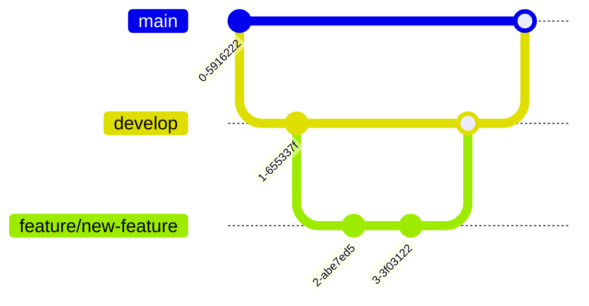

**一句话评价：**

**推荐指数：** ⭐⭐⭐⭐⭐ / 5

**使用建议：**

---

*模板创建时间：2026-03-09*
